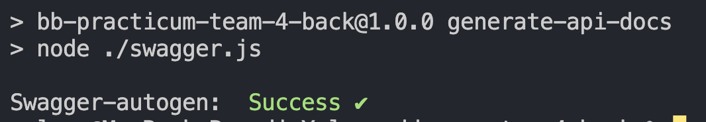
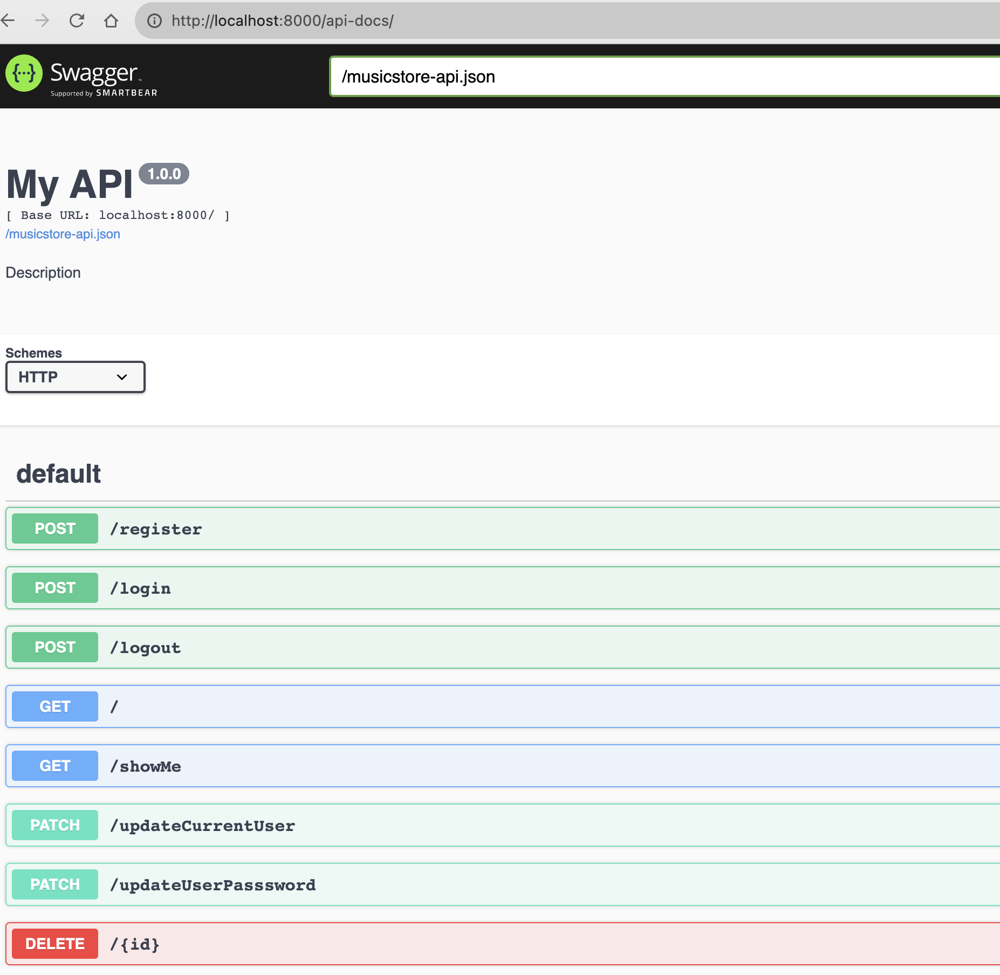
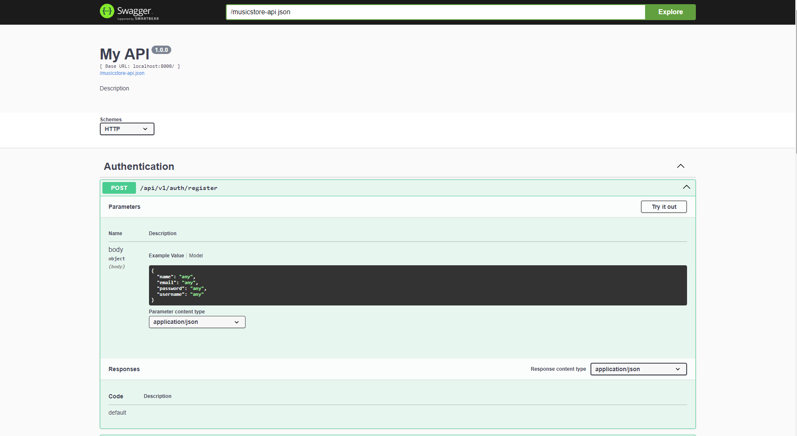
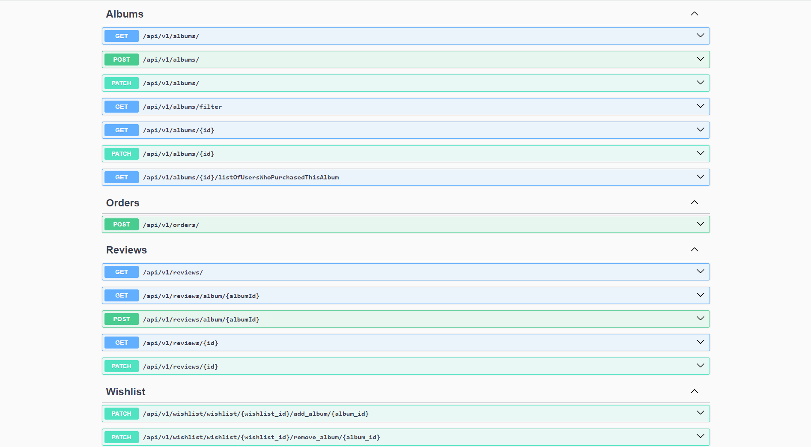
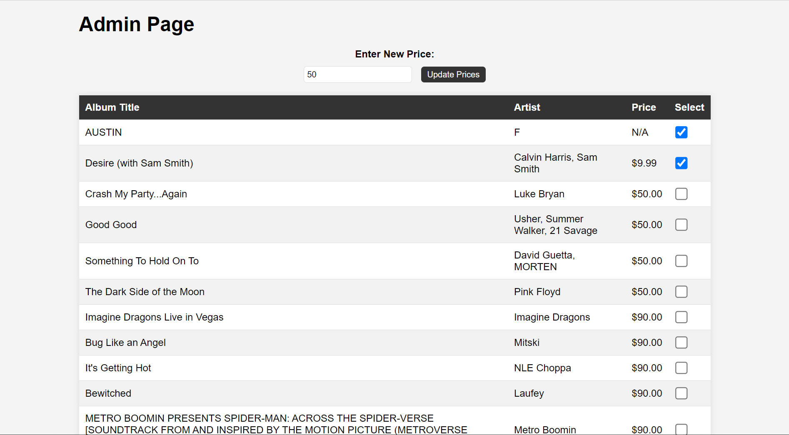

<!---# Back-End Repo for Node/React Practicum

This will be the API for the front-end React app part of your practicum project.

These instructions are for the **front-end team** so they can setup their local development environment to run
both the back-end server and their front-end app. You can go through these steps during your first group meeting
in case you need assistance from your mentors.

> The back-end server will be running on port 8000. The front-end app will be running on port 3000. You will need to run both the back-end server and the front-end app at the same time to test your app.

### Setting up local development environment

1. Create a folder to contain both the front-end and back-end repos
2. Clone this repository to that folder
3. Run `npm install` to install dependencies
4. Pull the latest version of the `main` branch (when needed)
5. Run `npm run dev` to start the development server
6. Open http://localhost:8000/api/v1/ with your browser to test.
7. Your back-end server is now running. You can now run the front-end app.

#### Running the back-end server in Visual Studio Code

Note: In the below example, the group's front-end repository was named `bb-practicum-team1-front` and the back-end repository was named `bb-practicum-team-1-back`. Your repository will have a different name, but the rest should look the same.


#### Testing the back-end server API in the browser


> Update the .node-version file to match the version of Node.js the **team** is using. This is used by Render.com to [deploy the app](https://render.com/docs/node-version).

### Generating and Using API Documentation

To generate and access the API documentation on backend, follow these steps:

1. Generate the API documentation using the provided script:

   ** `npm run generate-api-docs`**

   This command will generate the API documentation files in a suitable format.You should see an outcome similar to the one shown below:

   Outcome of the command
   

2. Run the application using the following command:

   **`npm run dev`**

   This will start the server, and you can access the application by navigating to `http://localhost:8000` in your web browser.

3. Once the documentation is generated, you can access it by opening the `api-docs` folder in your project's root directory.Open the following URL in your web browser to view the API documentation:
   `http://localhost:8000/api-docs/`

   You will see a page similar to the one shown below:

--->

# Music Store API

The Music Store API is a Node.js-based RESTful API for managing music albums, user accounts, reviews, wishlists, and orders for an online music store. It's designed with security and scalability in mind, utilizing various middleware and libraries to ensure a robust and secure backend for your music store application.

## Technology Stack

The **bb-practicum-team-4-back** project utilizes a comprehensive technology stack for building its backend:

### Core Technologies:

- **Node.js**: A JavaScript runtime environment for executing server-side code.
- **Express.js**: A web application framework for handling HTTP requests and routing.

### Database Management:

- **MongoDB**: A NoSQL database management system.
- **Mongoose**: An Object Data Modeling (ODM) library for MongoDB, simplifying database interactions and schema validation.

### Security and Authentication:

- **argon2**: A library for secure password hashing.
- **bcryptjs**: A library for hashing passwords.
- **jsonwebtoken**: Used for generating JSON Web Tokens (JWT) for authentication.
- **express-basic-auth**: Middleware for basic authentication.
- **express-xss-sanitizer**: Middleware for sanitizing user input to prevent cross-site scripting (XSS) attacks.
- **helmet**: A collection of middleware for securing Express.js applications.
- **passport**: Authentication middleware for Node.js.

### Logging and Monitoring:

- **winston**: A versatile logging library for Node.js, providing various features for logging and log management.

### API and Data Validation:

- **validator**: A library for data validation.
- **mongo-sanitize**: Middleware for sanitizing MongoDB queries to prevent NoSQL injection attacks.

### Web Security:

- **cors**: Middleware for handling Cross-Origin Resource Sharing (CORS) in Express.js applications.
- **express-rate-limit**: Middleware for rate limiting HTTP requests.

### Email Sending:

- **nodemailer**: A library for sending emails.

### External Services Integration:

- **spotify-web-api-node**: Node.js wrapper for the Spotify Web API.
- **stripe**: Library for processing payments, including credit card transactions.

### API Documentation:

- **swagger-ui-dist**: UI component for rendering Swagger documentation.
- **swagger-autogen**: Library for auto-generating Swagger documentation based on JSDoc comments.
- **swagger-jsdoc**: Library for generating Swagger documentation from JSDoc comments.
  ![Swagger Documentation]
  
  

### DevOps and CI/CD:

- **husky**: Git hooks library for enforcing code quality.
- **lint-staged**: Run linters on pre-committed files.
- **nodemon**: A utility for automatically restarting the Node.js server during development.
- **mongodb-memory-server**: A tool for spinning up an in-memory MongoDB database for testing.
- **Jest**: A JavaScript testing framework.
- **supertest**: A library for testing HTTP assertions.
- **eslint**: A tool for identifying and fixing problems in JavaScript code.
- **eslint-config-prettier**: ESLint configuration for Prettier.
- **eslint-plugin-jest**: ESLint plugin for Jest.
- **prettier**: Code formatter for maintaining code style consistency.

This diverse technology stack ensures robust, secure, and well-documented backend development for the **bb-practicum-team-4-back** project.

## Live Demo

You can explore a live demo of the Music Store application hosted on Render.com:

- **Frontend - Beat Bazaar:** [https://beatbazaar.onrender.com/](https://beatbazaar.onrender.com/)
- **Backend - Music Store API:** [https://musicstore.onrender.com/](https://musicstore.onrender.com/)

## Features

The Music Store API provides the following key features:

### User Management:

- User registration with roles (admin and user).
- User login and logout.
- User profile management, including updating user information and password.
- Retrieving a user's purchased albums and wishlists.

### Album Management:

- Creating, updating, and deleting albums (admin only).
- Fetching all albums, a single album, or albums filtered by various criteria.
- Retrieving all users who purchased a specific album.

### Review Management:

- Creating, updating, and deleting reviews.
- Fetching all reviews, reviews for a specific product, or a single review.
- Preventing users from submitting multiple reviews for the same product.

### Wishlist Management:

- Adding and removing albums from a user's wishlist.
- Fetching a user's wishlist.

### Order Management:

- Creating orders for albums.
- Fetching all orders and a single order.

### Admin Dashboard:

- A simple admin dashboard that allows administrators to update album prices.
  ![Admin Page]
  

## Prerequisites

Before running the Music Store API, ensure you have the following prerequisites installed:

- **Node.js**: You can download and install Node.js from the official website: [Node.js Downloads](https://nodejs.org/en/download/).

- **MongoDB**: You should have a MongoDB server running locally or provide a connection URI to an external MongoDB server. You can download MongoDB from the official website: [MongoDB Downloads](https://www.mongodb.com/try/download/community).

- **Stripe Account**: To enable payment processing, you'll need to sign up for a Stripe account and obtain the API secret key. Visit the Stripe website: [Stripe](https://stripe.com/).

## Installation

Follow these steps to set up and run the Music Store API on your local machine:

1. Clone the repository to your local machine:

   ```bash
   git clone git@github.com:Code-the-Dream-School/dd-prac-team4-back.git
   ```

Navigate to the project directory:

cd dd-prac-team4-back

Install the project dependencies:

npm install
Create a .env file in the project root directory and add the following environment variables:

.env

# MongoDB Connection URL (Insert your MongoDB connection URL here)

MONGO_URL=your-mongodb-connection-url

# JWT Secret Key (for token generation) (Insert your JWT secret here)

JWT_SECRET=your-jwt-secret

# JWT Lifetime (1 day) (Specify the JWT token lifetime, e.g., 1 day)

JWT_LIFETIME=1d

# Session Secret (for session management) (Insert your session secret here)

SESSION_SECRET=your-session-secret

# Spotify API Credentials (Insert your Spotify API credentials here)

SPOTIFY_CLIENT_ID=your-spotify-client-id
SPOTIFY_CLIENT_SECRET=your-spotify-client-secret

# Stripe API Secret Key (Insert your Stripe API secret key here)

STRIPE_SECRET_KEY=your-stripe-secret-key

# Admin Credentials (Insert your admin credentials here)

ADMIN_USERNAME=admin-username
ADMIN_PASSWORD=admin-password

# Order Expiry Durations (for local development and production) (Specify order expiry durations)

DEV_ORDER_EXPIRY_DURATION=72000000
PROD_ORDER_EXPIRY_DURATION=3600000

# Node Environment (development or production) (Specify the execution environment, e.g., development or production)

NODE_ENV=development

# Email Service and Credentials (Insert your email service and credentials here)

EMAIL_SERVICE=email-service-provider
EMAIL_USERNAME=email-username
EMAIL_PASSWORD=email-password

# Test Recipient Email Address (Insert a test recipient email address here)

TEST_RECIPIENT_EMAIL=test-recipient-email
Please replace your-mongodb-connection-url, your-jwt-secret, and other values with real data needed for your application.

Start the API server:

npm run dev
The API should now be running locally at http://localhost:8000.

Using Postman
You can use Postman to interact with the API endpoints. Below are some example requests:

User Registration:

POST http://localhost:8000/api/auth/register
Content-Type: application/json

{
"name": "John Doe",
"email": "johndoe@example.com",
"password": "securepassword",
"username": "johndoe"
}
User Login:

POST http://localhost:8000/api/auth/login
Content-Type: application/json

{
"email": "johndoe@example.com",
"password": "securepassword"
}
Create Album (Admin):

POST http://localhost:8000/api/albums
Content-Type: application/json
Authorization: Bearer your_access_token

{
"albumName": "Album Name",
"artistName": "Artist Name",
"price": 9.99,
"image": "album-image.jpg"
}
Fetch Albums:

GET http://localhost:8000/api/albums
Add Album to Wishlist:

POST http://localhost:8000/api/wishlist/add
Content-Type: application/json
Authorization: Bearer your_access_token

{
"albumId": "album_id_to_add_to_wishlist"
}
Create Order:

POST http://localhost:8000/api/orders
Content-Type: application/json
Authorization: Bearer your_access_token

{
"albumId": "album_id_to_purchase",
"quantity": 1
}
