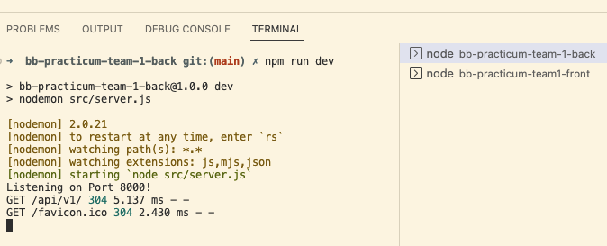
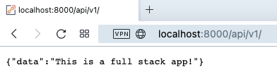

# Back-End Repo for Node/React Practicum

This will be the API for the front-end React app part of your practicum project.

These instructions are for the **front-end team** so they can setup their local development environment to run 
both the back-end server and their front-end app. You can go through these steps during your first group meeting 
in case you need assistance from your mentors.

>The back-end server will be running on port 8000. The front-end app will be running on port 3000. You will need to run both the back-end server and the front-end app at the same time to test your app.

### Setting up local development environment

1. Create a folder to contain both the front-end and back-end repos 
2. Clone this repository to that folder
3. Run `npm install` to install dependencies
4. Pull the latest version of the `main` branch (when needed)
5. Run `npm run dev` to start the development server
6. Open http://localhost:8000/api/v1/ with your browser to test.
7. Your back-end server is now running. You can now run the front-end app.

#### Running the back-end server in Visual Studio Code

Note: In the below example, the group's front-end repository was named `bb-practicum-team1-front` and the back-end repository was named `bb-practicum-team-1-back`. Your repository will have a different name, but the rest should look the same.

#### Testing the back-end server API in the browser

>Update the .node-version file to match the version of Node.js the **team** is using. This is used by Render.com to [deploy the app](https://render.com/docs/node-version).
