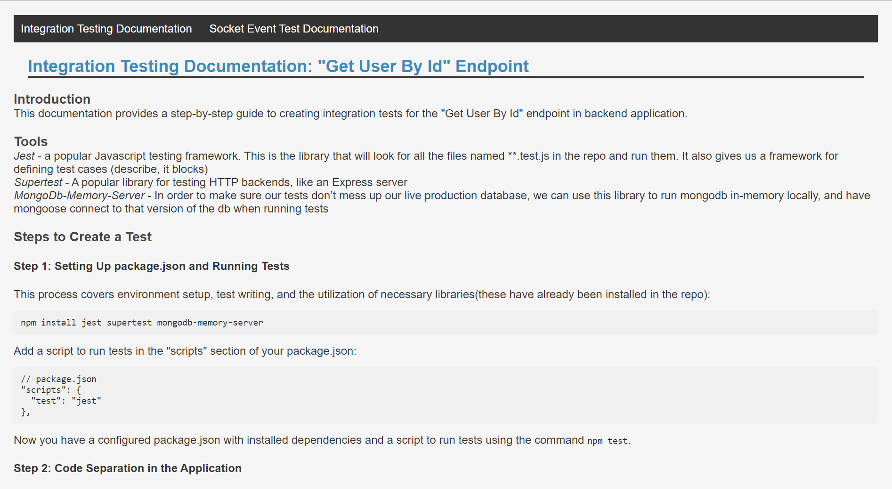

# Music Store API

The Music Store API is a Node.js-based RESTful API for managing music albums, user accounts, reviews, wishlists, and orders for an online music store. It's designed with security and scalability in mind, utilizing various middleware and libraries to ensure a robust and secure backend for music store application.

## Technology Stack

The **bb-practicum-team-4-back** project utilizes a comprehensive technology stack for building its backend:

### Core Technologies:

- **Node.js**: A JavaScript runtime environment for executing server-side code.
- **Express.js**: A web application framework for handling HTTP requests and routing.

### Database Management:

- **MongoDB**: A NoSQL database management system.
- **Mongoose**: An Object Data Modeling (ODM) library for MongoDB, simplifying database interactions and schema validation.

### Security and Authentication:

- **argon2**: A library for secure password hashing.
- **bcryptjs**: A library for hashing passwords.
- **jsonwebtoken**: Used for generating JSON Web Tokens (JWT) for authentication.
- **express-basic-auth**: Middleware for basic authentication.
- **express-xss-sanitizer**: Middleware for sanitizing user input to prevent cross-site scripting (XSS) attacks.
- **helmet**: A collection of middleware for securing Express.js applications.
- **passport**: Authentication middleware for Node.js.

### Logging and Monitoring:

- **winston**: A versatile logging library for Node.js, providing various features for logging and log management.

### API and Data Validation:

- **validator**: A library for data validation.
- **mongo-sanitize**: Middleware for sanitizing MongoDB queries to prevent NoSQL injection attacks.

### Web Security:

- **cors**: Middleware for handling Cross-Origin Resource Sharing (CORS) in Express.js applications.
- **express-rate-limit**: Middleware for rate limiting HTTP requests.

### Email Sending:

- **nodemailer**: A library for sending emails.

### External Services Integration:

- **spotify-web-api-node**: Node.js wrapper for the Spotify Web API.
- **stripe**: Library for processing payments, including credit card transactions.

### Real-Time Communication:

- **socket.io**: A library for real-time, bidirectional communication between clients and the server.
- **socket.io-client**: The client-side library for Socket.IO.

### API Documentation:

- **swagger-autogen**: Library for auto-generating Swagger documentation based on JSDoc comments.

#### Generating and Using API Documentation

To generate and access the API documentation on backend, follow these steps:

1. Generate the API documentation using the provided script:

   ** `npm run generate-api-docs`**

   This command will generate the API documentation files in a suitable format.You should see an outcome similar to the one shown below:

   Outcome of the command
   

2. Run the application using the following command:

   **`npm run dev`**

   This will start the server, and you can access the application by navigating to `http://localhost:8000` in your web browser.

3. Once the documentation is generated, you can access it by opening the `api-docs` folder in your project's root directory.Open the following URL in your web browser to view the API documentation:
   `http://localhost:8000/api-docs/`

   You will see a page similar to the one shown below:

#### Swagger Documentation


### DevOps and CI/CD:

- **husky**: Git hooks library for enforcing code quality.
- **lint-staged**: Run linters on pre-committed files.
- **nodemon**: A utility for automatically restarting the Node.js server during development.
- **mongodb-memory-server**: A tool for spinning up an in-memory MongoDB database for testing.
- **Jest**: A JavaScript testing framework.
- **supertest**: A library for testing HTTP assertions.
- **eslint**: A tool for identifying and fixing problems in JavaScript code.
- **eslint-config-prettier**: ESLint configuration for Prettier.
- **eslint-plugin-jest**: ESLint plugin for Jest.
- **prettier**: Code formatter for maintaining code style consistency.
- [Testing Documentation](http://localhost:8000/tests.html)
  

This diverse technology stack ensures robust, secure, and well-documented backend development for the **bb-practicum-team-4-back** project.

## Live Demo

You can explore a live demo of the Music Store application hosted on Render.com:

- **Frontend - Beat Bazaar:** [https://beatbazaar.onrender.com/](https://beatbazaar.onrender.com/)
- **Backend - Music Store API:** [https://musicstore.onrender.com/](https://musicstore.onrender.com/)

## Frontend Repository

You can find the frontend source code in our [Frontend Repository](https://github.com/Code-the-Dream-School/dd-prac-team4-front).

## Features

The Music Store API provides the following key features:

### User Management:

- **User Creation**: Efficiently create new users with validated information, including name, username, email, and password, using CRUD operations for effective user management and data security.
- **User Retrieval**: Access specific user data for effective tracking and management.
- **User Information Update**: Modify user information, including name, email address, and more.
- **User Deletion**: Remove users when necessary for efficient database management.
- **Profile Image Management**: Store profile image URLs and alternative text for enhanced user profiles.
- **Credit Card Data Management**: Securely store hashed credit card numbers, expiration dates, and preferred payment methods for user convenience and security.
- **Tracking Purchased Albums**: Keep a record of albums purchased by users to provide them with the best experience.
- **Password Comparison**: Ensure the correctness of entered passwords for account security.
- **Current User Password Update**: Allow users to safely update their passwords after verifying their old password.
- **Retrieving List of Purchased Albums**: Track albums that users have purchased to grant them access to their purchases.

### Album Management:

- **Creating Albums**: Effortlessly generate new album entries with artist name, album name, pricing, and other details. Utilizes CRUD operations for efficient album management.
- **Album Retrieval**: Access and retrieve specific album details for effective tracking and management.
- **Updating Album Information**: Modify album details, including artist name, album name, price, and more.
- **Bulk Price Update**: Update the prices of multiple albums at once, optimizing administrative tasks.
- **Album Filtering**: Filter albums based on criteria such as album name and artist name.
- **Spotify URL Validation**: Ensure the validity of Spotify URLs associated with albums.
- **Virtual Fields**: Utilize virtual fields to track users who have purchased specific albums.
- **Automatic Album Updates**: Automatically update album information and manage cancellations.
- **Tax Management**: Simplify tax calculations and management to ensure accurate album pricing.

### Review Management:

- **Creating, updating, and deleting reviews**: Easily create new reviews, update existing ones, and delete them using CRUD operations for efficient review management.
- **Fetching all reviews, reviews for a specific product, or a single review**: Access the complete list of all reviews, reviews for a specific product, or a selected review for effective tracking and management.
- **Preventing users from submitting multiple reviews for the same product**: Ensure that users cannot submit multiple reviews for the same product.

### Wishlist Management:

- **Creating a Wishlist**: Create a user's wishlist, or retrieve an existing one if it already exists.
- **Adding and Removing Albums**: Add albums to a user's wishlist or remove them as needed.
- **Fetching a User's Wishlist**: Retrieve a user's wishlist to view the albums they've added.

### Order Management:

- **Creating Album Orders**: Easily generate album orders with detailed pricing, utilizing CRUD operations for efficient management.
- **Order Retrieval**: Access and retrieve specific order details for effective tracking and management.
- **Stripe Integration**: Securely process album order payments via Stripe, ensuring a safe and convenient checkout.
- **Automatic Order Updates and TTL Functionality**: Automatically update orders, cancel unpaid ones after a defined time for accurate statuses, and remove canceled orders after a set duration for streamlined data management.
- **Tax Management**: Simplify tax calculations and management for precise order pricing.

### Admin Dashboard:

- A simple admin dashboard that allows administrators to update album prices.
  ![Admin Page]
  

## Prerequisites

Before running the Music Store API, ensure you have the following prerequisites installed:

- **Node.js**: You can download and install Node.js from the official website: [Node.js Downloads](https://nodejs.org/en/download/).

- **MongoDB**: You should have a MongoDB server running locally or provide a connection URI to an external MongoDB server. You can download MongoDB from the official website: [MongoDB Downloads](https://www.mongodb.com/try/download/community).

- **Stripe Account**: To enable payment processing, you'll need to sign up for a Stripe account and obtain the API secret key. Visit the Stripe website: [Stripe](https://stripe.com/).

- **Spotify App Credentials**: Additionally, for certain functionalities, you'll need Spotify app credentials. These can be set up using the following instructions: [Spotify Developer Documentation](https://developer.spotify.com/documentation/web-api).

## Installation

Follow these steps to set up and run the Music Store API on your local machine:

1. Clone the repository to your local machine:

   ```bash
   git clone git@github.com:Code-the-Dream-School/dd-prac-team4-back.git
   ```

2. Navigate to the project directory:

```bash
cd dd-prac-team4-back
```

3. Install the project dependencies:

```bash
npm install
```

4. Create a .env file in the project root directory and add the following environment variables:

```bash
.env
# MongoDB Connection URL (Insert your MongoDB connection URL here)
MONGO_URL=your-mongodb-connection-url

# JWT Secret Key (for token generation) (Insert your JWT secret here)
JWT_SECRET=your-jwt-secret

# JWT Lifetime (1 day) (Specify the JWT token lifetime, e.g., 1 day)
JWT_LIFETIME=1d

# Session Secret (for session management) (Insert your session secret here)
SESSION_SECRET=your-session-secret

# Spotify API Credentials (Insert your Spotify API credentials here)
SPOTIFY_CLIENT_ID=your-spotify-client-id
SPOTIFY_CLIENT_SECRET=your-spotify-client-secret

# Stripe API Secret Key (Insert your Stripe API secret key here)
STRIPE_SECRET_KEY=your-stripe-secret-key

# Admin Credentials (Insert your admin credentials here)
ADMIN_USERNAME=admin-username
ADMIN_PASSWORD=admin-password

# Order Expiry Durations (for local development and production) (Specify order expiry durations)
DEV_ORDER_EXPIRY_DURATION=72000000
PROD_ORDER_EXPIRY_DURATION=3600000

# Node Environment (development or production) (Specify the execution environment, e.g., development or production)
NODE_ENV=development

# Email Service and Credentials (Insert your email service (eg: 'gmail', 'outlook', 'mailgun', etc) and credentials here)
EMAIL_SERVICE=email-service-provider
EMAIL_USERNAME=email-username
EMAIL_PASSWORD=email-password
# Test Recipient Email Address (Insert a test recipient email address here)
TEST_RECIPIENT_EMAIL=test-recipient-email
```

Please replace your-mongodb-connection-url, your-jwt-secret, and other values with real data needed for your application.

5. Start the API server:

```bash
npm run dev
```

6. The API should now be running locally at http://localhost:8000

7. You can use Postman to interact with the API endpoints.
